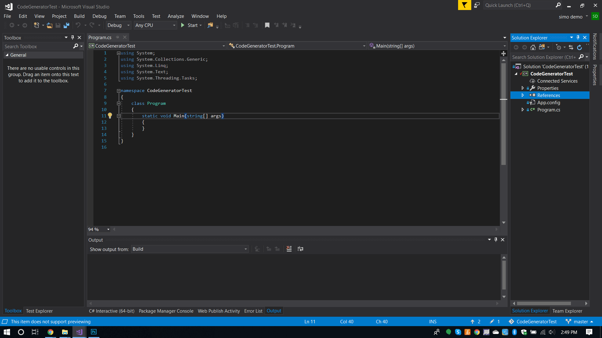

# CodeGen

This Library allows you to generate a class with the same properties as the given one.

This utility make life easier when it comes to implement the [DTO pattern](<https://www.codeproject.com/articles/1050468/data-transfer-object-design-pattern-in-csharp>) or [MVVM](<https://www.c-sharpcorner.com/UploadFile/raj1979/simple-mvvm-pattern-in-wpf/>) patterns or whenever you find yourself in need of using an extensive an amount of object all identical to each other but with different data types or purposes.




## Usage

1. Add a reference to the project.

2. pick the object you want to convert e.g.:

   `class Ciccio
       {
           public int val { get; set; }
           public string name { get; set; }
           public int valN;
       }`

3. Add the using directive to CodeGen

   `using CodeDOM2.CodeGen;`

4. Instantiate a CodeGenerator object of the type you want to convert e.g.:

   `            CodeGenerator<Ciccio> convObjCreator = new CodeGenerator<Ciccio>();`

5. Run the AutogenerateDTO method to generate the DTO object from your source type:

   `string myClass = convObjCreator.AutogenerateDTO(new Ciccio());`

6. Enjoy the result, perhaps by writing it to a file:

   ```csharp
   //------------------------------------------------------------------------------
   // <auto-generated>
   //     This code was generated by a tool.
   //     Runtime Version:4.0.30319.42000
   //
   //     Changes to this file may cause incorrect behavior and will be lost if
   //     the code is regenerated.
   // </auto-generated>
   //------------------------------------------------------------------------------
   
   namespace AutogenCode {
       using System;
       
       public class CiccioDTO {
       
       public int val { get; set; };
       
       public string name { get; set; };
   	}
   }
   ```
   ## Why?

   This Utility is also a handy reference to the basic usage of the [Dynamic  Source Code Generation and Compilation.](<https://docs.microsoft.com/en-us/dotnet/framework/reflection-and-codedom/using-the-codedom>) One of those topics that seldom gets used and because of that use to be forgotten.

   

